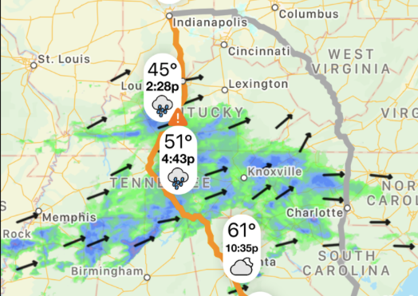

# Integrate your app with Weather on the Way by adding "Open in Weather on the Way" button

Weather on the Way provides comprehensive weather forecast for a selected route, helping users avoid bad weather, pick the best time to leave and stay safe while on the road.



If you are a developer of an iOS road trip, motorcycle, cycling or hiking app, adding an ability to see the weather on the route with a single button tap will greatly improve the capabilities of your app, without much work on your side. In fact, if your app already supports GPX file export, adding "Open in Weather on the Way" button will not take longer than 10 minutes. 

This repository provides an example of an app that opens Weather on the Way and a guide on how to implement it in your own app. 

## Implementation details 

### Step 1

Add `Queried URL Schemes` option to your `Info.plist` as an array that contains value of `weatherontheway`

```
<key>LSApplicationQueriesSchemes</key>
    <array>
        <string>weatherontheway</string>
    </array>
```


### Step 2 

Create GPX data, as you would do when exporting a GPX file. If your app doesn't currently export GPX files, we recommend [CoreGPX library](https://github.com/vincentneo/CoreGPX).

Here is an example of creating GPX data if you are using CoreGPX:
```
import CoreGPX

let gpxData = try gpxRoot.gpx().data(using: .utf8)

```


When you have gpx file encoded as data, simply run the following code when "Open in Weather on the Way" is pressed. 

```
// Create a Base64 string
let dataEncoded = gpxData.base64EncodedString()

// Create a deeplink to Weather on the Way
let urlString = "weatherontheway://gpx-data/".appending(dataEncoded)

if let url = URL(string: urlString) {

    // Check if Weather on the Way is installed
    if UIApplication.shared.canOpenURL(url) {
        // open GPX data
        UIApplication.shared.open(url)
    } else {
        // open AppStore to download Weather on the Way
        UIApplication.shared.open(URL(string: "https://get.weatherontheway.app/gpx-import")!)
    }
}
```


Calling the URL will redirect straight to Weather on the Way app and open the attached data. 

That's it! 

## Design considerations 

When designing a button / control that will activate this functionality please follow these guidelines: 

### Button label

Do: 
- Label the button with a reference to app name, such as "Open in Weather on the Way", "Check in Weather on the Way", "Export to Weather on the Way", "Weather on the Way", etc. 
- If you are using app name, make sure that only the first and last words are capitalised. 
- Alternatively, you can label the button with a generic term referring to checking the weather such as "Check weather on the route", "Weather on this route", "See weather on the route", "Check weather", etc . 

Don't: 
- Do not use any abbreviations such as "WOTW", "On the way", "WeatherOnTheWay". 
- Do not use different capitalisations such as "Weather On The Way", "weather on the way" or "WEATHER ON THE WAY"


### Icon 

If you want to use an icon on the button:
- You can use either our app icon (included in this repository ["weather_on_the_way_icon.png"](weather_on_the_way_icon.png)), or a provided SF Symbol (["weather-on-the-way.SFSymbol.svg"](weather-on-the-way.SFSymbol.svg)).
- Alternatively, use a generic SF Symbol that suggests exporting to other apps, such as "arrow.up.document" or referring to weather: "cloud.sun.rain", "cloud.sun.bolt". 


## GPX file format considerations 

GPX files contain 3 primary objects - Waypoints (wpt), Routes (rte) and Tracks (trk). Weather on the Way supports these in the following way: 


### Waypoints 
If the file contains only Waypoints, the app will load these in order and calculate routing between them. The routing speed and settings will be based on user's settings in the app. The maximum number of waypoints that the app supports is 50. 

### Routes 
If the file contains Routes, the app will load their start and end points as waypoints and calculate routing between them, same as in the case of waypoints data. If the file contains both Routes and Waypoints, Routes data takes precedence.  


### Tracks 
If the file contains Tracks, the app will load them as the exact route specified by the Track, without performing routing calculations. 

If the Track does not contain speed information, the user will be asked to enter the average speed they expect to travel. This might impact the accuracy of the forecast, so make sure to specify the speed information when implementing GPX export. This is done by including `<time>` value inside every track point `<trkpt>`. 

If the file contains both Tracks and Waypoints, the Waypoints will be considered as stop points along the track, as long as they are within 100m of any of the track points. 

Weather on the Way supports importing only a single track per file. 

### Other

Weather on the Way does not support any GPX extension formats. 


